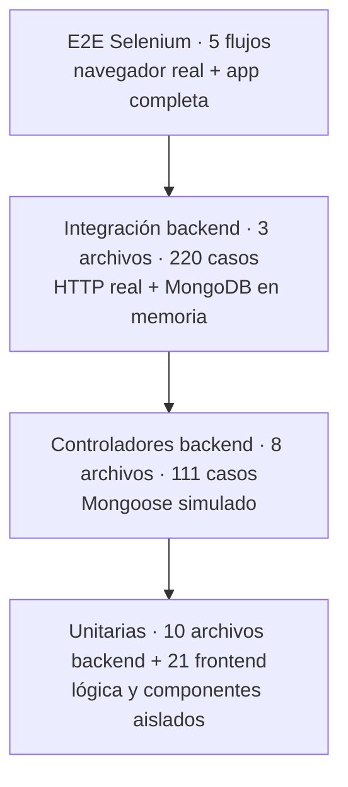

# Guía de pruebas — Contabiliza Ágil

Esta guía explica qué pruebas tiene el proyecto, cómo se corren y cómo explicarlas.

**Última verificación: 2026-09-26.**

| Suite | Archivos | Casos | Resultado |
|---|---|---|---|
| Backend | 21 | 535 | ✅ |
| Frontend | 21 | 286 | ✅ |
| E2E Selenium | 5 flujos | 6 escenarios | ✅ |

---

## 1. La pirámide de pruebas



Cada capa responde una pregunta distinta:

| Capa | Pregunta que responde | Velocidad |
|---|---|---|
| **Unitarias** | ¿Esta función o este componente hace bien su trabajo por sí solo? | milisegundos |
| **Controladores** | ¿El controlador responde con el código y los datos correctos ante cada caso? | milisegundos |
| **Integración** | ¿Rutas, middlewares, controladores y base de datos funcionan juntos por HTTP? | segundos |
| **E2E** | ¿Un usuario real, en Chrome, puede completar el flujo de punta a punta? | 20–30 s |

Herramientas:
- **Backend:** Jest, más supertest para las peticiones HTTP y mongodb-memory-server para una base MongoDB en memoria.
- **Frontend:** Jest y React Testing Library.
- **E2E:** selenium-webdriver con Chrome y scripts propios; no usan Jest ni Cucumber.

---

## 2. Inventario

Los casos se cuentan como Jest los reporta: un `test.each` con 10 filas cuenta como 10.

### Backend (`backend/tests/`)

#### `unit/`: lógica aislada

| Archivo | Casos | Qué cubre |
|---|---|---|
| `intents.test.js` | 79 | Intenciones que el chat resuelve sin IA: saludo, navegación según el rol, datos del usuario, cartera, cálculo de IVA/ReteFuente/ICA, fuera de tema, inyección |
| `ai.service.test.js` | 38 | Selección del proveedor (`AI_PROVIDER`), reglas del proveedor mock y el enrutador `responder()`: local → IA → mock |
| `models.test.js` | 22 | Modelos Mongoose (Factura, FacturaCartera, Tercero, Puc, Role, User, Sequence), incluido el cálculo automático de impuestos |
| `passwordPolicy.test.js` | 16 | Política de contraseñas y generación de la contraseña temporal |
| `role.middleware.test.js` | 8 | Middleware de roles |
| `auth.middleware.test.js` | 6 | JWT válido, inválido o ausente; cuenta inactiva (401) y cuenta no aprobada (403) |
| `impuestosCalculator.test.js` | 6 | Cálculo de IVA, retenciones e ICA |
| `seedInitialData.test.js` | 4 | Semilla idempotente: roles, admin y catálogo PUC |

#### `controllers/`: un archivo por controlador, con Mongoose simulado

| Archivo | Casos |
|---|---|
| `user.controller.test.js` | 23 |
| `aprobaciones.controller.test.js` | 18 |
| `tercero.controller.test.js` | 18 |
| `factura.controller.test.js` | 15 |
| `puc.controller.test.js` | 15 |
| `facturaCartera.controller.test.js` | 9 |
| `auth.controller.test.js` | 7 |
| `role.controller.test.js` | 6 |

#### `integration/`: HTTP real contra MongoDB en memoria

| Archivo | Casos | Qué cubre |
|---|---|---|
| `rbac.test.js` | 130 | Matriz de permisos: 29 rutas × 4 roles, más casos extra; cada rol recibe 403 donde no tiene permiso |
| `users.auth.test.js` | 49 | Registro, login, cuentas bloqueadas o sin aprobar, perfil, cambio de contraseña, gestión de usuarios |
| `facturas.cartera.test.js` | 41 | Facturas, cartera, pagos/abonos, reportes, paginación y el endpoint del chat con estadísticas reales |

#### `providers/`: proveedor Groq con el SDK simulado; nunca llama a la API real

| Archivo | Casos | Qué cubre |
|---|---|---|
| `groq.security.test.js` | 15 | Sanitización del contexto y de los mensajes, límites de longitud, intentos de inyección |
| `groq.provider.test.js` | 10 | Modelo configurable, modelo de respaldo ante 404, errores tipados, respuesta vacía |

#### Soporte

- **`tests/setup.js`:**
  - levanta MongoDB en memoria;
  - fuerza `AI_PROVIDER=mock` y vacía las variables SMTP, para no usar servicios reales del `.env`;
  - borra facturas, PUC, terceros y cartera **después de cada test**.
- **`tests/helpers/testHelpers.js`:** crea usuarios con un rol y devuelve su token.

### Frontend (`frontend/src/**/__tests__/`)

| Archivo | Casos | Qué cubre |
|---|---|---|
| `utils/validation.test.ts` | 55 | Validaciones de formularios: correo, nombres, contraseña, montos, campos de factura, contacto e identificación |
| `data/data.test.ts` | 25 | Catálogos estáticos: cuentas PUC, opciones de retención, guía de retenciones y retención recomendada según el detalle |
| `utils/utils.test.ts` | 23 | Formato de moneda y fechas (`formatFecha`), carga de archivos, alertas y `apiFetch` (token en cabecera) |
| `CatalogosTercerosPuc.test.tsx` | 18 | Terceros y PUC: listar, crear, editar y permisos por rol |
| `Aprobaciones.test.tsx` | 17 | Aprobar o rechazar registros y ver documentos |
| `Facturas.test.tsx` | 17 | Crear factura, cálculo de impuestos, filtros, permisos del auxiliar |
| `ChatBot.test.tsx` | 16 | Abrir y cerrar, enviar, markdown, navegación, errores, sugerencias, Reintentar, Nueva conversación, bloqueo según rol |
| `FacturaCartera.test.tsx` | 16 | Facturas de venta, abonos, selectores con búsqueda remota |
| `Login.test.tsx` | 14 | Validación, login correcto o incorrecto, mensaje uniforme |
| `App.test.tsx` | 13 | Menú lateral según el rol, sesión y cierre de sesión |
| `Register.test.tsx` | 10 | Registro y validaciones |
| `Usuarios.test.tsx` | 9 | Gestión de usuarios (admin) |
| `Perfil.test.tsx` | 8 | Datos personales y cambio de contraseña |
| `export.test.ts` | 7 | Exportación a PDF y Excel |
| `Home.test.tsx` | 7 | Panel de control |
| `Reportes.test.tsx` | 6 | Filtros automáticos y exportación |
| `AuthPage`, `DocumentoUploader`, `RecuperarDocumento`, `Paginacion`, `SelectBusqueda` | 5 c/u | Componentes pequeños y reutilizables |

Configuración: `frontend/jest.config.js` fija `TZ=America/Bogota`, para que las fechas se prueben como las ve un usuario en Colombia.

### E2E Selenium (`tests/e2e/`)

| Archivo | Flujo |
|---|---|
| `login.test.js` | Credenciales inválidas → error; admin válido → entra; cerrar sesión → vuelve al login |
| `register.test.js` | Llena el formulario de registro completo y lo envía |
| `facturas.test.js` | Crea una factura y verifica que aparezca en la lista |
| `terceros-cartera.test.js` | Crea un tercero, le hace una factura de cartera y registra un abono |
| `roles.test.js` | Crea un contador y un auxiliar vía API; verifica el menú visible de cada uno |

Archivos de soporte:
- **`helpers.js`:**
  - arma el driver y hace el login;
  - `chooseReactSelect` para los selectores con búsqueda;
  - `createUserWithRole` prepara datos por API, sin depender del correo;
  - `runTest` toma una captura si la prueba falla.
- **`all-tests.js`:** corre todas las suites y resume el resultado.

### CI (`.github/workflows/tests.yml`)

Se ejecuta en cada push o PR a `main` y `develop`, en este orden:
1. instala dependencias;
2. corre `npm run test:unit`;
3. levanta el backend y el frontend;
4. corre los E2E;
5. sube la cobertura y las capturas de los fallos como artefactos.

---

## 3. Cómo correrlas

### Todo desde la raíz

```bash
npm run test:unit      # backend + frontend en paralelo
npm run test:e2e       # E2E (requiere la app levantada, ver abajo)
npm run test:all       # unitarias y luego E2E
```

### Backend

```bash
cd backend
npm test                                         # las 21 suites (~50 s)
npm run test:unit                                # sin los tests de providers
npm run test:ia                                  # solo providers (Groq simulado)
npm run test:watch                               # modo observador
npm run test:coverage                            # con reporte de cobertura
npm test -- tests/unit/intents.test.js           # un solo archivo
npm test -- tests/unit/intents.test.js -t "IVA"  # solo los tests cuyo nombre contiene "IVA"
```

No hace falta tener MongoDB instalado: cada corrida crea una base en memoria.

### Frontend

```bash
cd frontend
npm test                             # las 21 suites (~20 s)
npm run test:watch
npm run test:coverage
npm test -- ChatBot                  # un archivo (coincide por nombre)
npm test -- ChatBot -t "reintentar"  # un test puntual
```

### E2E

1. **Levantar la app con base en memoria y la IA simulada**, para que cada corrida empiece con datos limpios (admin `admin@admin.com` / `admin123` y catálogo PUC de 46 cuentas):
   ```bash
   USE_MEM_MONGO=true AI_PROVIDER=mock npm start       # Git Bash
   ```
   En PowerShell: `$env:USE_MEM_MONGO='true'; $env:AI_PROVIDER='mock'; npm start`
2. **En otra terminal:**
   ```bash
   cd tests
   npm run test:headless   # todas, sin ventana
   npm test                # todas, viendo el navegador
   npm run test:login      # (también test:register, test:facturas, test:cartera, test:roles)
   ```

### Chat contra la IA real (manual)

```bash
cd backend && npm run chat:escenarios
```

- Usa `GROQ_API_KEY` del `.env` y consume cuota.
- Imprime cada pregunta de la matriz con su respuesta y su origen (`local`, `groq` o `mock`), para revisarlas a ojo.
- No es un test automático.

---

## 4. Cómo leer los resultados

### Salida de Jest

```
Test Suites: 21 passed, 21 total
Tests:       535 passed, 535 total
```

- **Test Suites:** número de archivos.
- **Tests:** número de casos.
- Si algo falla, Jest muestra el nombre del test, el valor esperado frente al recibido y la línea exacta.
- Con `-t`, los casos que no coinciden aparecen como `skipped`.

### Cobertura

`npm run test:coverage` genera:
- `backend/coverage/lcov-report/index.html`
- `frontend/coverage/lcov-report/index.html`

Abre el HTML en el navegador para ver, por archivo, qué líneas se ejecutaron (en verde) y cuáles no (en rojo).

### E2E

Cada paso se registra con hora y un emoji. El final es `Resultado: 5/5 suites exitosas`. Si una prueba falla:
- se guarda `tests/error-<nombre>.png` con la pantalla en ese momento;
- el comando termina con código 1.

Las capturas están en `.gitignore`.

---

## 5. Cómo explicarlas (ejemplos comentados)

### Unitaria: el chat calcula el IVA sin IA (`backend/tests/unit/intents.test.js`)

```js
test.each([
  ['IVA de 1.500.000', /285\.000.*1\.785\.000/],
  ['iva de 2 millones', /380\.000/],
  ['iva de 850 mil',    /161\.500/],
])('IVA: "%s"', (q, esperado) => {
  expect(resolver(q, ctx()).reply).toMatch(esperado);
});
```

**Qué decir:**
- Una sola definición prueba varias formas de escribir un monto: con puntos, "millones" o "mil".
- `ctx()` es un contexto de usuario falso, así que no hay base de datos ni red: la prueba es instantánea y determinista.
- Garantiza que los cálculos del chat salen de la calculadora del sistema y no de la IA, que podría equivocarse.

### Integración: permisos por rol (`backend/tests/integration/rbac.test.js`)

```js
const MATRIX = [
  ['PUT',  `/api/facturas/${id}`, GESTION],        // el auxiliar no puede editar
  ['POST', '/api/puc',            ADMIN_CONTADOR],
  ['GET',  '/api/users',          ADMIN],
  // ...
];
```

**Qué decir:**
- La tabla es la especificación de permisos.
- El test crea un usuario real por rol y hace la petición HTTP a cada ruta con el token de cada uno.
- Si el rol no está en la lista, espera un **403**.
- Agregar una regla nueva es agregar una fila, y cualquier cambio accidental de permisos rompe el test.

### Frontend: reintentar tras un error (`frontend/src/components/__tests__/ChatBot.test.tsx`)

```tsx
mockApi
  .mockImplementationOnce(() => Promise.reject(new Error('offline')))  // 1.ª vez: falla la red
  .mockImplementationOnce(() => reply({ reply: 'Ahora sí respondo' })); // 2.ª vez: responde
send('¿qué es el PUC?');
fireEvent.click(await screen.findByRole('button', { name: 'Reintentar' }));
expect(await screen.findByText('Ahora sí respondo')).toBeInTheDocument();
expect(screen.getAllByText('¿qué es el PUC?')).toHaveLength(1);  // no duplica la pregunta
```

**Qué decir:**
- Se simula la API (`apiFetch`) para provocar un fallo y luego un éxito.
- La prueba interactúa como un usuario: busca botones por su nombre accesible y hace clic.
- Verifica lo que se ve en pantalla, no los detalles internos del componente.

### E2E: el menú según el rol (`tests/e2e/roles.test.js`)

```js
const { email, password } = await createUserWithRole(role); // datos preparados por API
await login(driver, email, password);                       // Chrome real
const menu = await visibleMenu(driver);                     // opciones visibles
if (JSON.stringify(menu) !== JSON.stringify(ESPERADO[role])) throw new Error(...);
```

**Qué decir:**
- Es la prueba más cercana al usuario: abre Chrome, inicia sesión y lee el menú real.
- Los datos se preparan por API porque es más rápido y no depende del correo.
- Solo la interacción que se quiere validar pasa por la interfaz.

### Guion corto para una presentación

1. **Tenemos más de 800 pruebas automáticas en cuatro capas**, más 5 flujos E2E en navegador.
2. **Las unitarias** protegen la lógica de negocio: impuestos, contraseñas, intenciones del chat y validaciones.
3. **Las de integración** prueban la API completa sobre una base de datos real en memoria, incluida la matriz de permisos por rol (130 casos).
4. **Las de frontend** verifican cada pantalla como la usaría una persona.
5. **Las E2E** recorren en Chrome los flujos críticos: login, registro, facturación, cartera con abono y menú por rol.
6. **Todo corre en GitHub Actions** en cada push. Las pruebas nunca usan servicios reales: la IA y el correo están simulados, y la base es temporal.

---

## 6. Problemas frecuentes

| Síntoma | Causa y solución |
|---|---|
| E2E: `tab crashed` / `session deleted` | Chrome se actualizó y `chromedriver` quedó desfasado. Mira la versión `chrome=X` en el error y ejecuta `cd tests && npm install chromedriver@X`. |
| E2E: "Sin resultados" en la Cuenta PUC, o datos inesperados en el panel | La app está conectada a la base persistente y no a la de memoria. Levántala con `USE_MEM_MONGO=true`. |
| E2E: `EADDRINUSE :3000` | Quedó un backend anterior vivo. En Windows, cerrar `npm start` no siempre termina los procesos `node` hijos: ciérralos (`netstat -ano \| findstr :3000` y luego `taskkill /PID <pid> /F`). |
| Un test de backend no encuentra datos creados en `beforeAll` | `setup.js` borra facturas, PUC, terceros y cartera después de **cada** test. Crea esos datos dentro del test. |
| Fechas corridas un día | Las fechas se guardan a medianoche UTC. Muéstralas con `formatFecha`. Los tests de frontend usan la zona horaria de Bogotá. |
| Correos reales al crear usuarios desde un script | El `.env` local tiene SMTP real. Jest lo desactiva; los scripts propios no. Crea los usuarios por `/auth/register`, como hacen los E2E. |
